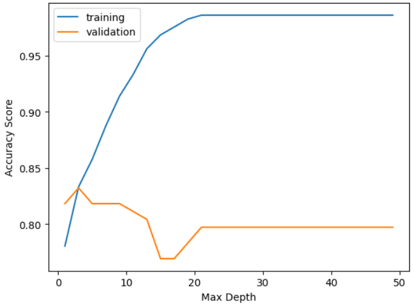
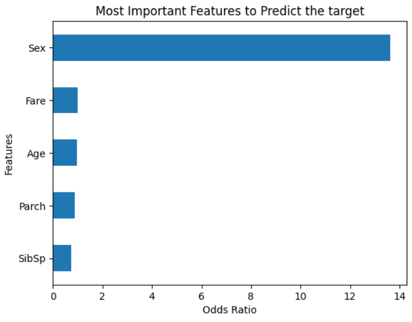

# Titanic-Survival-Prediction

# Overview
A classifier that can predict whether a passenger can survive the sinking of the Titanic

# Data Collection

Data has already available [here](https://www.kaggle.com/datasets/yasserh/titanic-dataset). The dataset contains only 892 observations with 12 features.

# Data Preprocessing

In the dataset, `Cabin` column has **more than 50% NULL** values. `PassengerId`, `Name`, `Ticket`, `Embarked` has low-high cardinality problem. And need to convert some categorical feature to numerical value.

# Model Training

Datasets is trained using `Logistic Regression`, `Decision Tree`, `Support Vector Machine (SVM)` and `Random Forest` classification models. `Logistic Regression` performs best where as `SVM` performs worst.

# Result Analysis
In the table we see the beseline models accuracy, training and testing accuracy of the respective models.
<table>
<thead>
    <tr>
      <th>Model</th>
      <th>Baseline Accuracy</th>
      <th>Training Accuracy</th>
      <th>Testing Accuracy</th>
    </tr>      
  </thead>
<tbody>
  <tr>
    <td>Logistic Regression</td>
    <td>0.6235</td>
    <td>0.8005</td>
    <td>0.8100</td>
  </tr>

  <tr>
    <td>Decision Tree</td>
    <td>0.6235</td>
    <td>0.8330</td>
    <td>0.7988</td>
  </tr>

  <tr>
    <td>SVM</td>
    <td>0.6235</td>
    <td>0.6713</td>
    <td>0.6648</td>
  </tr>

  <tr>
    <td>Random Forest</td>
    <td>0.6235</td>
    <td>0.8523</td>
    <td>0.8044</td>
  </tr>

  <tr>
    <td>KNN</td>
    <td>0.6235</td>
    <td>0.8049</td>
    <td>0.6983</td>
  </tr>
  </tbody>
</table>

All the models beat the baseline model.

# Decision Tree Flexibility
Fromt the image we can see, upto `Max Depth = 3 to 4`, accuracy of training and validaiton data is getting higher. After that, `Training Accuracy` inceases but `Validation Accuracy` decreases due to `Decision Trees Flexibility`.

  

# Features Importance

From the image we can see, there are many features that effect the prediction of the survival. But `Sex` impact most of it.

  

